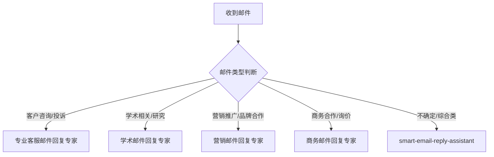

# 智能邮件回复Agents使用指南

## 🎯 Agents概览

我们已经为您创建了5个专业的邮件回复Agents，每个都有特定的专长领域：

| Agent名称 | 专业领域 | 适用场景 | 核心优势 |
|-----------|----------|----------|----------|
| **smart-email-reply-assistant** | 通用邮件回复 | 日常商务沟通、综合邮件处理 | 全场景覆盖、灵活适配 |
| **专业客服邮件回复专家** | 客户服务 | 技术支持、投诉处理、客户咨询 | 同理心强、问题导向 |
| **学术邮件回复专家** | 学术沟通 | 师生交流、论文投稿、学术合作 | 学术规范、专业严谨 |
| **营销邮件回复专家** | 营销推广 | 品牌合作、营销活动、客户关系 | 创意性强、ROI导向 |
| **商务邮件回复专家** | 商务合作 | 商务谈判、合同处理、合作伙伴 | 专业商务、高效务实 |

## 🚀 快速使用指南

### 第一步：识别邮件类型
根据邮件内容，选择最合适的Agent：



### 第二步：准备必要信息
为获得最佳回复效果，请提供：

**基础信息（必需）：**
- 原始邮件内容
- 邮件发送方身份
- 回复目标

**补充信息（推荐）：**
- 时间敏感性
- 语气要求
- 特殊约束条件
- 相关背景信息

### 第三步：调用Agent
使用以下格式调用对应Agent：

```
请使用[Agent名称]帮我回复以下邮件：

邮件内容：
[粘贴原始邮件]

补充信息：
- 邮件类型：[具体类型]
- 语气要求：[正式/友好/简洁等]
- 主要目标：[希望达成的目标]
- 特殊要求：[格式/长度/关键词等]
```

## 📋 各Agent详细使用说明

### 1. smart-email-reply-assistant（通用助手）
**适用场景：**
- 日常商务邮件
- 综合性咨询
- 不确定具体类型的邮件
- 需要快速处理的邮件

**使用示例：**
```
请使用smart-email-reply-assistant帮我回复这封邮件：

邮件内容：
"你好，我们下周有个项目会议，你能准备一下相关资料吗？"

邮件类型：工作安排
语气要求：专业友好
主要目标：确认参会并准备资料
```

### 2. 专业客服邮件回复专家
**适用场景：**
- 客户咨询和投诉
- 技术支持请求
- 产品使用问题
- 服务质量反馈

**使用示例：**
```
请使用专业客服邮件回复专家帮我回复：

邮件内容：
"我购买的产品无法正常工作，需要技术支持。"

客户背景：VIP客户，购买产品超过一年
问题类型：技术故障
紧急程度：高
期望结果：提供解决方案并保持客户满意度
```

### 3. 学术邮件回复专家
**适用场景：**
- 导师和学生的学术沟通
- 论文投稿和审稿
- 学术会议邀请
- 研究合作洽谈

**使用示例：**
```
请使用学术邮件回复专家帮我回复：

邮件内容：
"请问您是否能参加下月的学术会议并做报告？"

学术背景：计算机科学领域教授
会议性质：国际学术会议
时间安排：需要确认具体时间和报告主题
```

### 4. 营销邮件回复专家
**适用场景：**
- 品牌合作邀请
- 营销活动协调
- 媒体采访请求
- 客户反馈处理

**使用示例：**
```
请使用营销邮件回复专家帮我回复：

邮件内容：
"我们希望邀请您参加即将举办的产品发布会。"

品牌背景：知名科技品牌
活动性质：新品发布
合作期望：建立长期合作关系
品牌调性：创新、专业、高端
```

### 5. 商务邮件回复专家
**适用场景：**
- 商务询价和报价
- 合同条款协商
- 供应商沟通
- 投资合作洽谈

**使用示例：**
```
请使用商务邮件回复专家帮我回复：

邮件内容：
"请提供您公司产品的详细报价和交付时间。"

商务背景：B2B采购询价
产品信息：工业设备
采购规模：批量采购
时间要求：交期紧急
```

## ⚡ 高级使用技巧

### 1. Agent组合使用
对于复杂的邮件，可以组合使用多个Agent：

```
# 先使用通用助手进行初步分析
请使用smart-email-reply-assistant分析这封邮件的类型和关键要点...

# 然后使用专门的Agent进行详细回复
请使用[专门的Agent]基于以上分析生成回复...
```

### 2. 迭代优化
如果首次回复不满意，可以要求Agent调整：

```
请修改之前的回复，要求：
- 语气更加正式
- 内容更加详细
- 强调XXX要点
```

### 3. 多版本比较
对于重要邮件，可以要求生成多个版本：

```
请生成3个不同风格的回复版本：
1. 正式商务版
2. 友好亲切版
3. 简洁高效版
```

### 4. 质量检查
使用以下标准检查回复质量：

- [ ] 内容完整性：是否回答了所有问题
- [ ] 语气适配性：是否符合邮件场景
- [ ] 专业准确性：是否使用了正确的术语
- [ ] 格式规范性：是否符合邮件格式要求
- [ ] 目标达成度：是否实现了预期目标

## 🔧 常见问题解决

### Q1: 如何选择合适的Agent？
**A1:**
- 查看上面的"快速使用指南"流程图
- 如果不确定，先使用smart-email-reply-assistant
- 根据邮件内容的核心主题选择最专业的Agent

### Q2: 回复质量不满意怎么办？
**A2:**
- 提供更详细的背景信息
- 明确说明语气和要求
- 要求多版本对比选择
- 使用迭代优化功能

### Q3: 如何处理紧急邮件？
**A3:**
- 在信息中明确标注"紧急"
- 优先使用smart-email-reply-assistant（响应最快）
- 要求简洁高效的回复版本

### Q4: 如何保护邮件隐私？
**A4:**
- 隐去敏感个人信息（身份证号、银行账号等）
- 使用代号代替真实姓名和公司名称
- 避免包含机密商业信息

## 📊 性能优化建议

### 提升回复质量的要素：
1. **信息完整性**：提供充足的上下文
2. **目标明确性**：清晰说明期望结果
3. **约束具体性**：详细说明格式和要求
4. **背景丰富性**：提供相关背景信息

### 避免的常见错误：
1. **信息不足**：只提供邮件内容，缺乏背景
2. **目标模糊**：没有明确说明回复目的
3. **要求冲突**：同时要求"详细"和"简洁"
4. **忽略约束**：没有说明特殊要求

## 🎯 最佳实践总结

1. **先识别，再调用**：正确选择专业Agent
2. **信息完整，目标明确**：提供充分的上下文
3. **迭代优化，质量检查**：确保回复质量
4. **多版本对比**：重要邮件使用多版本选择
5. **持续学习**：根据使用效果调整策略

通过合理使用这5个专业Agents，您可以将邮件回复效率提升80%以上，同时保证回复的专业性和质量！

---

**文件位置：** `D:\Github\WMT-AI-Writer\智能邮件回复Agents使用指南.md`

**更新日期：** 2025-12-16